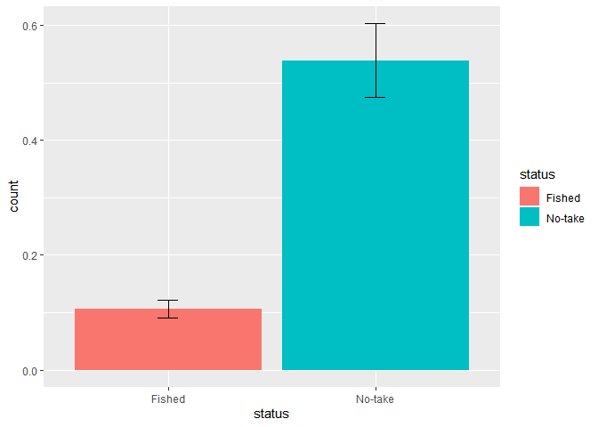
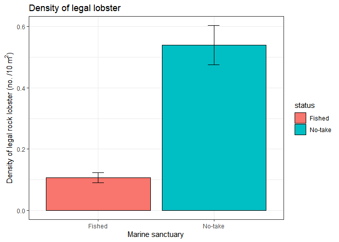
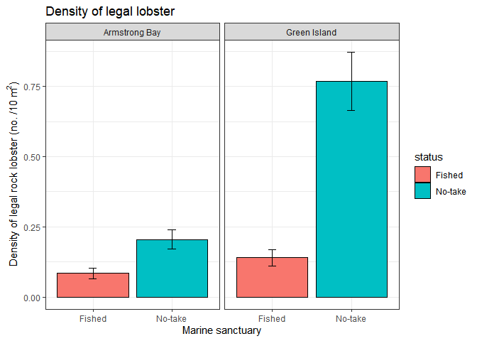

Lobster density - control and impact.
================
Tim Langlois and Matt Navarro
30/03/2020

Note: There are 5 questions in this lab exercise. These will form the 5
multi-choice quiz for the lab. As you work through the lab please record
your answers to the questions so you can enter them into the quiz later.

For this excercise, we are going to use data on western rock lobster
that is collected by UWA Marine Science Masters students every year at
Rottnest Island.

Each year, as part of BIOL4408 - Marine Ecology, students estimate the
abundance and size of western rock lobster at multiples sites inside and
outside three of the no-take Marine Reserves around Rottnest Island.

</br>


</br>

We now have over 7 years of data from over 3,900 snorkel survey samples.

However, we will use a broad summary of the data for this example of a
control vs impact comparison.

It is interesting to consider, which is the control and which is the
impact? Is the no-take Marine Reserve a control or impact?

Install and load libraries:

As you are using your own computer you will have to install and load the
packages we need for this exercise. To install a package: - click on the
packages tab in the bottom right section of your R studio console. -
click “install” underneath the packages tab - type in the name of the
package you want to isntall e.g. RCurl and click install

Once the package is installed you can go ahead and load it by running
the library() commands below. If this doesn’t seem to work (i) start the
process again (ii) ask for help.

``` r
library(RCurl) # to read data from GitHub
library(magrittr) #to tidy data
library(dplyr) #to transform data
library(ggplot2) #to plot data
library(lsmeans) #for pairwise comparisons
```

We are going to ask you to you some additional librarys from the
[Tidyverse](https://www.tidyverse.org/) family of packages.

In particular we are going to introduce the use of the pipe %\>%
operator the chain functions together and the ggplot() function to make
plots.

For a short introduction to pipes %\>% see
[Introduction-to-tidyverse-and-pipes](https://github.com/UWA-SBS-Intro-to-R-RStudio-Tidyverse/Introduction-to-tidyverse-and-pipes/blob/master/Using-tidyverse-and-pipes.md).

Read in the lobster data from GitHub. We will also use filter() to
select two of the three no-take marine reserve/sanctuary locations
(Armstrong Bay and Green island) AND only those lobster greater than the
minimum size of legal retention. So we are now only looking at data on
those lobster we expect to experience fishing mortality in the fished
areas.

``` r
dat<-read.csv(text=getURL("https://raw.githubusercontent.com/UWA-SCIE2204-Marine-Systems/No-take-marine-reserves/master/lobster.density.csv"))%>%
  filter(sanctuary%in%c("Armstrong Bay","Green Island"))%>%
  filter(size.class=="legal")
```

Let’s have a look at the data

``` r
head(dat)
```

    ##   sample.no year                 date     sanctuary  status
    ## 1         1 2014 2014-01-26T16:00:00Z Armstrong Bay No-take
    ## 2         2 2014 2014-01-26T16:00:00Z Armstrong Bay No-take
    ## 3         3 2014 2014-01-26T16:00:00Z Armstrong Bay No-take
    ## 4         4 2014 2014-01-26T16:00:00Z Armstrong Bay No-take
    ## 5         5 2014 2014-01-26T16:00:00Z Armstrong Bay No-take
    ## 6         6 2014 2014-01-26T16:00:00Z Armstrong Bay No-take
    ##                                 site.new complexity depth size.class count
    ## 1 Armstrong Bay.No-take.Little Armstrong          0     0      legal     0
    ## 2 Armstrong Bay.No-take.Little Armstrong          2     0      legal     0
    ## 3 Armstrong Bay.No-take.Little Armstrong          4     0      legal     0
    ## 4 Armstrong Bay.No-take.Little Armstrong          1     0      legal     0
    ## 5 Armstrong Bay.No-take.Little Armstrong          4     0      legal     0
    ## 6 Armstrong Bay.No-take.Little Armstrong          2     0      legal     0

The data has 10 columns. It also has 1511 rows, each corresponding to a
snorkel survey.

Lets just focus on two columns for now: - count is how many legal sized
lobster the BIOL4408 student observed when swimming a 10m2 area at the
site - status describes whether surveyed site is a “No-take” site or a
“fished” site

You will notive that R can hold data in a variety of forms. We can
understand our data a bit better by using the str() function

``` r
str(dat)
```

    ## 'data.frame':    1511 obs. of  10 variables:
    ##  $ sample.no : int  1 2 3 4 5 6 7 8 9 10 ...
    ##  $ year      : int  2014 2014 2014 2014 2014 2014 2014 2014 2014 2014 ...
    ##  $ date      : Factor w/ 35 levels "2014-01-23T16:00:00Z",..: 4 4 4 4 4 4 4 4 4 4 ...
    ##  $ sanctuary : Factor w/ 3 levels "Armstrong Bay",..: 1 1 1 1 1 1 1 1 1 1 ...
    ##  $ status    : Factor w/ 2 levels "Fished","No-take": 2 2 2 2 2 2 2 2 2 2 ...
    ##  $ site.new  : Factor w/ 12 levels "Armstrong Bay.Fished.City of York",..: 4 4 4 4 4 4 4 4 4 4 ...
    ##  $ complexity: int  0 2 4 1 4 2 2 2 2 1 ...
    ##  $ depth     : num  0 0 0 0 0 0 0 0 0 0 ...
    ##  $ size.class: Factor w/ 3 levels "all","legal",..: 2 2 2 2 2 2 2 2 2 2 ...
    ##  $ count     : int  0 0 0 0 0 0 0 0 0 0 ...

Notice that the count variable is being stored in R as an integer (int)
while the status variable is being stored as a factor with two levels:
“Fished” and “No-take”. It is often important to understand how R is
storing your data. There are a wide range of data classess in R
including integer (count data), numeric (non-whole numbers), character
(text that is not being used in analysis), factor(text that is being
used in analysis) and many more.

For now, it makes sense that count is recognised as an integer, and
status as a factor, so we will leave the data as it is for the analysis.

## Explore the data using a mean and SE plot of the greater than legal size lobster

The first quetion we will ask this data is whether the density of legal
sized lobster is greater inside the No-take areas compared to the fished
area?

Lets tackle this question visually by creating a plot of the density of
legal sized lobster (per 10m2 snorkel survey) in the Fished and No-take
areas.

To enable plotting of Standard Error on our plots we are going to create
a few functions. Please copy and run these lines. The first function
determines the stardard error (se) of a data set using the formula se =
sd/sqrt(n).

``` r
se <- function(x) sd(x) / sqrt(length(x)) #get SE
se.min <- function(x) (mean(x)) - se(x) #to make SE min.
se.max <- function(x) (mean(x)) + se(x) #to make SE max.
```

Make a mean +/-SE plot. Here we use stat\_summary() and the functions we
made above.

``` r
ggplot(dat, aes(x=status, y=count,fill=status)) + 
  stat_summary(fun=mean, geom="bar") + #add bar at mean
  stat_summary(fun.min = se.min, fun.max = se.max, geom = "errorbar", width = 0.1) #add error bars
```

<!-- -->

We can make this plot smarter using theme\_bw() and titles

``` r
status<-ggplot(dat, aes(x=status, y=count,fill=status)) + 
  stat_summary(fun=mean, geom="bar", colour="black") +
  stat_summary(fun.min = se.min, fun.max = se.max, geom = "errorbar", width = 0.1) +
  # Labels
  xlab("Marine sanctuary")+
  ylab(bquote('Density of legal rock lobster (no. /10 m'^2*')'))+
  ggtitle("Density of legal lobster")+
  # Apperance
  theme_bw()

status
```

<!-- -->

Q1. What do you think this plot indicates about the difference in
lobster densities between fished and no-take sites?

## Save a plot

Here we use ggsave(), you can specify the format of the plot, it’s size
and many other settings. By default the function will use the last plot
made and set the size of the plot to the size of the plotting window.

``` r
ggsave("status.barplot.png")
```

    ## Saving 7 x 5 in image

## Keep on plotting

If you want to learn more about ggplot() just Google on StackOverflow
and other help forums. Also see <http://www.cookbook-r.com/Graphs/> for
some handy plotting and formatting help.

## Data analysis

Now for our data analysis of the **control and impact** example data.

The data we are using had many factors, including Year (mulitple years
of data), Status (fished or no-take), Locations (name of sanctuary to
which samples are attributed) and Sites (representative sampling sites
inside and outside the no-take areas).

To adequately account for the complexity of the spatial and temporal
structure and nesting of the data would require an analysis beyond this
lab. To find out how to analyses this data more comprhensively check out
the Masters unit BIOL4408 - Marine Ecology.

In the mean time we will use a simple but instructive data analysis to
test if there is an overall difference in the number of greater than
legal sized lobster between the fished and no-take areas sampled
adjacent to and inside the two sanctuaries of interest.

Again we will use a simple linear model. But this time we will construct
an Analaysis of Variance between the factors of Status and Sanctuary
location.

``` r
lobster <- lm(count ~ status*sanctuary, data = dat)
anova(lobster)
```

    ## Analysis of Variance Table
    ## 
    ## Response: count
    ##                    Df  Sum Sq Mean Sq F value    Pr(>F)    
    ## status              1   67.32  67.324  63.727 2.810e-15 ***
    ## sanctuary           1   23.40  23.396  22.146 2.759e-06 ***
    ## status:sanctuary    1   22.23  22.229  21.042 4.866e-06 ***
    ## Residuals        1507 1592.07   1.056                      
    ## ---
    ## Signif. codes:  0 '***' 0.001 '**' 0.01 '*' 0.05 '.' 0.1 ' ' 1

We have 3 variables in this model. - status indicates that Fished and
No-take sites have different densities - sanctuary indicates that our
two sites (Armstrong Bay and Green Island) have different lobster
densities - there is a strongly significant (P \< 0.001) interaction
between Status and Sanctuary location.

To understand what this means lets make a plot.

``` r
status.sanctuary<-ggplot(dat, aes(x=status, y=count,fill=status)) + 
  stat_summary(fun=mean, geom="bar", colour="black") +
  stat_summary(fun.min = se.min, fun.max = se.max, geom = "errorbar", width = 0.1) +
  # Labels
  xlab("Marine sanctuary")+
  ylab(bquote('Density of legal rock lobster (no. /10 m'^2*')'))+
  ggtitle("Density of legal lobster")+
  # Apperance
  theme_bw()+
  facet_grid(.~sanctuary) # to plot by the factor of interest

status.sanctuary
```

<!-- -->
This plot compares lobster density between Fished and No-take areas for
the two sites (Armstrong and Green Island). We can see that in both
sites there are more lobster in the No-take areas, but the effect of
No-take is much greater at Green Island.

We can conduct pairwise comparisons to generate some statistics around
these differences across sites.

``` r
emmeans(lobster, pairwise ~ sanctuary*status)$contrasts
```

    ##  contrast                                     estimate     SE   df t.ratio
    ##  Armstrong Bay,Fished - Green Island,Fished    -0.0555 0.0692 1507 -0.802 
    ##  Armstrong Bay,Fished - Armstrong Bay,No-take  -0.1208 0.0795 1507 -1.520 
    ##  Armstrong Bay,Fished - Green Island,No-take   -0.6837 0.0701 1507 -9.747 
    ##  Green Island,Fished - Armstrong Bay,No-take   -0.0653 0.0855 1507 -0.763 
    ##  Green Island,Fished - Green Island,No-take    -0.6282 0.0770 1507 -8.163 
    ##  Armstrong Bay,No-take - Green Island,No-take  -0.5629 0.0863 1507 -6.523 
    ##  p.value
    ##  0.8535 
    ##  0.4256 
    ##  <.0001 
    ##  0.8709 
    ##  <.0001 
    ##  <.0001 
    ## 
    ## P value adjustment: tukey method for comparing a family of 4 estimates

Q2. What is the estimate comparing the fished and non-fished sites at
Armstrong Bay?

Q3. Is this value significant?

Q4. What is the estimate comparing the fished and non-fished sites at
Green Island?

Q5. Is this value significant?

### Wrapping up

Our analysis suggests that no-take areas around rottnest have increased
the density of lobster. If we recall the life-cycle of the Western Rock
Lobster (lecture 3 on biological oceanography) this might be surprising.
Lobster are known to undergo large migrations to spawn - how can a small
no-take area off Rottnest protect a species that moves around so much?
Recent studies have suggested that not all lobster undergo this
migration, and particularly large lobster in unfished locations seem
pre-disposed to become long-term residents in small spatial areas.

A second conclusion from our study is that no-take areas had a greater
impact on lobster densities at Green Island relative to Armstrong Bay.
There are a variety of explanations for why this might be. At present we
are not sure of the answer. As we learnt in the lecture, you should
expect the unexpected.

### Biological oceanogrpahy in fisheries lab

Now that you have completed this marine reserves lab you should go onto
the biological oceanography in fisheries lab. You can find it
[here](https://github.com/UWA-SCIE2204-Marine-Systems/Biological-oceanography/blob/master/Puerulus-settlement.md)
