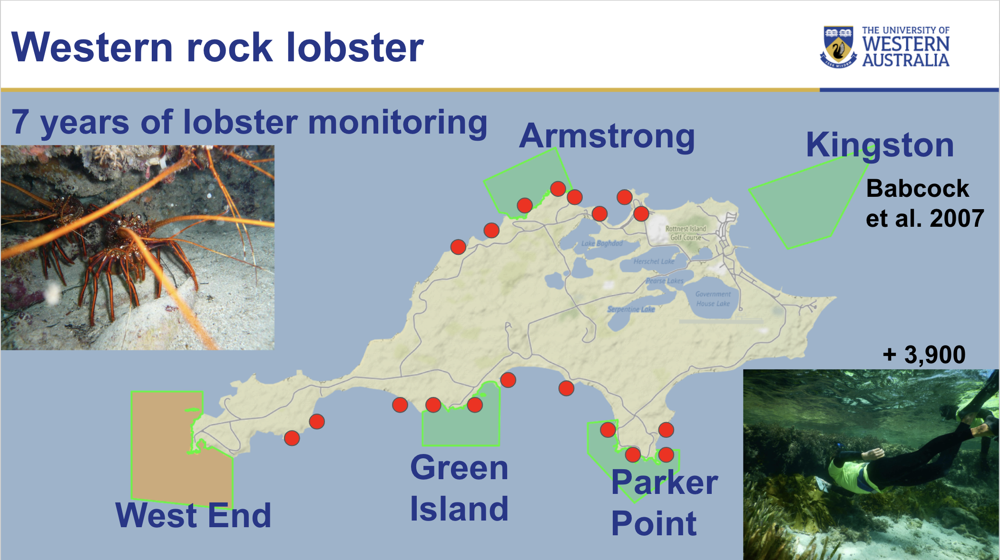
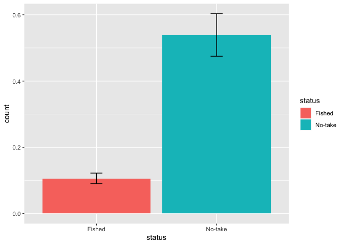
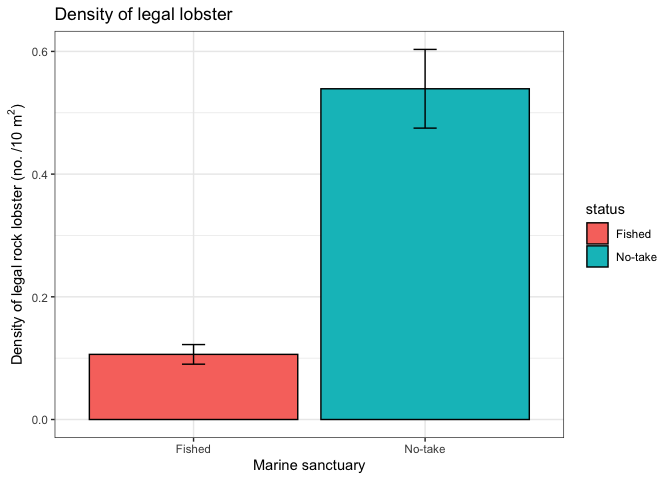
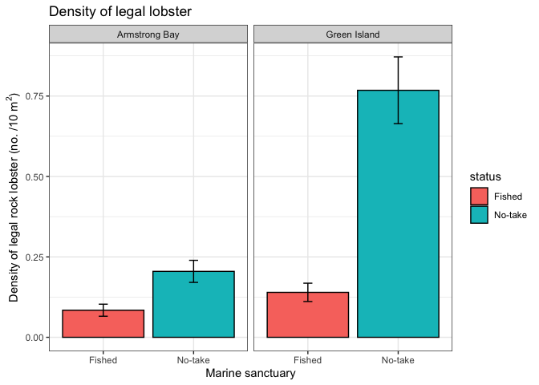

BIOL4408 Marine Ecology: Lobster density 4.
================
Tim Langlois and Matt Navarro
30/03/2020

For this excercise, we are going to use data on western rock lobster
that is collected by UWA Marine Science Masters students every year at
Rottnest Island.

Each year, as part of BIOL4408 - Marine Ecology, students estimate the
abundance and size of western rock lobster at multiples sites inside and
outside three of the no-take Marine Reserves around Rottnest Island.

</br>



</br>

We now have over 7 years of data from over 3,900 snorkel survey samples.

However, we will use a broad summary of the data for this example of a
control vs impact comparison.

It is interesting to consider, which is the control and which is the
impact? Is the no-take Marine Reserve a control or impact?

Load extra librarys

``` r
library(RCurl) # to read data from GitHub
library(tidyr) #to tidy data
library(dplyr) #to transform data
library(ggplot2) #to plot data
```

We are going to ask you to you some additional librarys from the
[Tidyverse](https://www.tidyverse.org/) family of packages.

In particular we are going to introduce the use of the pipe %\>%
operator the chain functions together and the ggplot() function to make
plots.

For a short introduction to pipes %\>% see
[Introduction-to-tidyverse-and-pipes](https://github.com/UWA-SBS-Intro-to-R-RStudio-Tidyverse/Introduction-to-tidyverse-and-pipes/blob/master/Using-tidyverse-and-pipes.md).

Read in the lobster data from GitHub and glimpse() the first 5 rows and
the format of the
data

``` r
dat<-read.csv(text=getURL("https://raw.githubusercontent.com/UWA-SCIE2204-Marine-Systems/No-take-marine-reserves/master/lobster.density.csv"))%>%
  filter(sanctuary%in%c("Armstrong Bay","Green Island"))%>%
  filter(size.class=="legal")%>%
  glimpse()
```

    ## Observations: 1,511
    ## Variables: 10
    ## $ sample.no  <int> 1, 2, 3, 4, 5, 6, 7, 8, 9, 10, 11, 12, 13, 14, 15, 16, 17,…
    ## $ year       <int> 2014, 2014, 2014, 2014, 2014, 2014, 2014, 2014, 2014, 2014…
    ## $ date       <fct> 2014-01-26T16:00:00Z, 2014-01-26T16:00:00Z, 2014-01-26T16:…
    ## $ sanctuary  <fct> Armstrong Bay, Armstrong Bay, Armstrong Bay, Armstrong Bay…
    ## $ status     <fct> No-take, No-take, No-take, No-take, No-take, No-take, No-t…
    ## $ site.new   <fct> Armstrong Bay.No-take.Little Armstrong, Armstrong Bay.No-t…
    ## $ complexity <int> 0, 2, 4, 1, 4, 2, 2, 2, 2, 1, 3, 1, 1, 2, 1, 3, 1, 2, 2, 0…
    ## $ depth      <dbl> 0, 0, 0, 0, 0, 0, 0, 0, 0, 0, 0, 0, 0, 0, 0, 0, 0, 0, 0, 0…
    ## $ size.class <fct> legal, legal, legal, legal, legal, legal, legal, legal, le…
    ## $ count      <int> 0, 0, 0, 0, 0, 0, 0, 0, 0, 0, 0, 0, 1, 0, 0, 0, 0, 0, 0, 0…

We have also used filter() to select two of the three no-take marine
reserve/sanctuary locations AND only those lobster greater than the
minimum size of legal retention. So we are now only looking at data on
those lobster we expect to experience fishing mortality in the fished
areas.

We are also going to create functions to enable plotting of Standard
Error on our plots. Please cooy and run these lines

``` r
se <- function(x) sd(x) / sqrt(length(x))
se.min <- function(x) (mean(x)) - se(x) #to make SE min.
se.max <- function(x) (mean(x)) + se(x) #to make SE max.
```

## Explore the data using a mean and SE plot of the greater than legal size lobster

Make a mean +/-SE plot. Here we use stat\_summary() and the functions we
made above.

``` r
ggplot(dat, aes(x=status, y=count,fill=status)) + 
  stat_summary(fun.y=mean, geom="bar") + #add bar at mean
  stat_summary(fun.ymin = se.min, fun.ymax = se.max, geom = "errorbar", width = 0.1) #add error bars
```

<!-- -->

We can make this plot smarter using theme\_bw() and titles

``` r
status<-ggplot(dat, aes(x=status, y=count,fill=status)) + 
  stat_summary(fun.y=mean, geom="bar", colour="black") +
  stat_summary(fun.ymin = se.min, fun.ymax = se.max, geom = "errorbar", width = 0.1) +
  # Labels
  xlab("Marine sanctuary")+
  ylab(bquote('Density of legal rock lobster (no. /10 m'^2*')'))+
  ggtitle("Density of legal lobster")+
  # Apperance
  theme_bw()

status
```

<!-- -->

## Save a plot

Here we use ggsave(), you can specify the format of the plot, it’s size
and many other settings. By default the function will use the last plot
made and set the size of the plot to the size of the plotting window.

``` r
ggsave("status.barplot.png")
```

    ## Saving 7 x 5 in image

## Keep on plotting

If you want to learn more about ggplot() just Google on StackOverflow
and other help forums. Also see <http://www.cookbook-r.com/Graphs/> for
some handy plotting and formatting help.

Now for our data analysis of the **control and impact**.

The data we are using had many factors, including Year (mulitple years
of data), Status (fished or no-take), Locations (name of sanctuary to
which samples are attributed) and Sites (representative sampling sites
inside and outside the no-take areas). To adequately account for the
complexity of the spatial and temporal structure and nesting of the data
would require an analysis beyhond this lab. To find out how to analyses
this data more comprhensively check out the Masters unit BIOL4408 -
Marine Ecology. In the mean time we will use a simple but instructive
data analysis to test if there is an overall difference in the number of
greater than legal sized lobster between the fished and no-take areas
sampled adjacent to and inside the two sanctuaries of interest.

Again we will use a simple linear model. But this time we will construct
an Analaysis of Variance between the factors of Status and Sanctuary
location.

``` r
lobster <- lm(count ~ status*sanctuary, data = dat)
anova(lobster)
```

    ## Analysis of Variance Table
    ## 
    ## Response: count
    ##                    Df  Sum Sq Mean Sq F value    Pr(>F)    
    ## status              1   67.32  67.324  63.727 2.810e-15 ***
    ## sanctuary           1   23.40  23.396  22.146 2.759e-06 ***
    ## status:sanctuary    1   22.23  22.229  21.042 4.866e-06 ***
    ## Residuals        1507 1592.07   1.056                      
    ## ---
    ## Signif. codes:  0 '***' 0.001 '**' 0.01 '*' 0.05 '.' 0.1 ' ' 1

There is a strongly significant (P \< 0.001) interaction between Status
and Sanctuary location.

We can make a plot to investigate this.

``` r
status.sanctuary<-ggplot(dat, aes(x=status, y=count,fill=status)) + 
  stat_summary(fun.y=mean, geom="bar", colour="black") +
  stat_summary(fun.ymin = se.min, fun.ymax = se.max, geom = "errorbar", width = 0.1) +
  # Labels
  xlab("Marine sanctuary")+
  ylab(bquote('Density of legal rock lobster (no. /10 m'^2*')'))+
  ggtitle("Density of legal lobster")+
  # Apperance
  theme_bw()+
  facet_grid(.~sanctuary) # to plot by the factor of interest

status.sanctuary
```

<!-- -->
